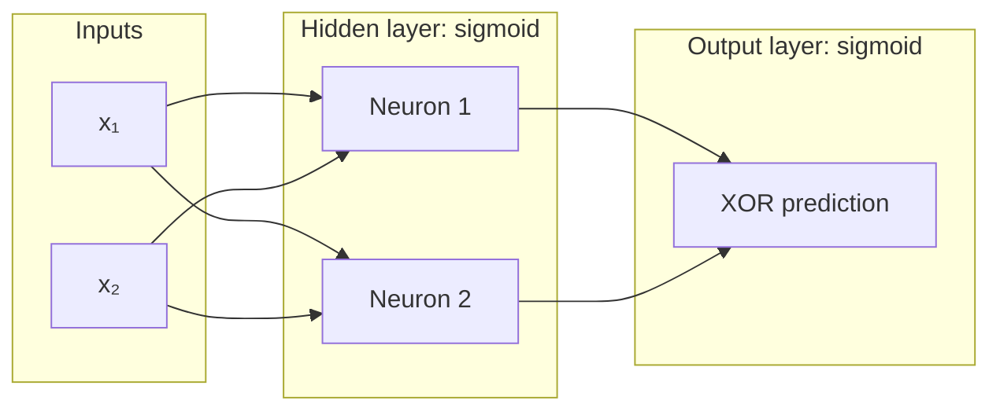

# Brainlet

A neural network from scratch in Julia without third-party libraries. It started as a single-neuron proof of concept, learned AND, OR, and NAND gates, and now trains on XOR.

## Current implementation

The XOR model has two inputs, two hidden neurons, and one output neuron. Every neuron in a layer receives every value from the previous layer. Each neuron has its own bias and uses the sigmoid activation function.



Training uses all four XOR input pairs. The cost is mean squared error, and gradients are estimated with finite differences before gradient descent updates each weight and bias. Backpropagation is a future step.

## Version snapshots

- [Single neuron](https://github.com/aileks/Brainlet/tree/single-neuron): learns `y = 2x`.
- [AND, OR, and NAND gates](https://github.com/aileks/Brainlet/tree/or-and-gates): one sigmoid neuron with two inputs. The branch ends with NAND training data.
- [XOR gate](https://github.com/aileks/Brainlet/tree/xor-gate): adds a hidden layer so the network can learn XOR. This is also the current version on `main`.

## Run

Requires Julia 1.10.12 or newer. From the repository root:

```sh
julia --project=. main.jl
```

The script prints the cost during training, then prints predictions for all four XOR inputs. It runs for 100,000 epochs, so the cost output is long.

## Next steps

- Replace finite differences with backpropagation.
- Try a binary adder, then more complex training problems.

Possible later problems include spiral classification, learning a small grayscale image from pixel coordinates, handwritten digit recognition with MNIST, locating a transmitter from noisy sensor readings, recognizing Morse code timing, and predicting where a bouncing ball hits a wall.
