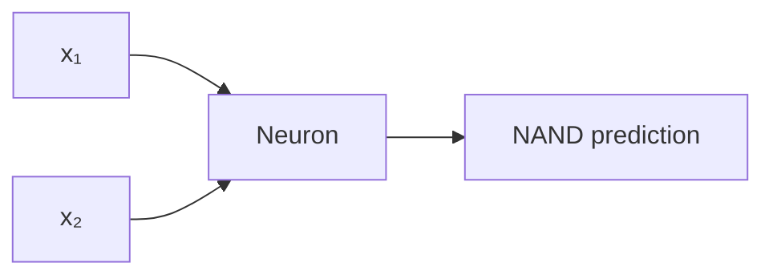

# Brainlet - A Neural Network

A neural network from scratch in Julia without third-party libraries.

## Current Implementation

This version is trained on a NAND gate. The model has two inputs and one neuron with a sigmoid activation function. The neuron has two weights and one bias.



## Version snapshots

- [Single neuron](https://github.com/aileks/Brainlet/tree/single-neuron) - learns `y = 2x`
- [AND, OR, and NAND gates](https://github.com/aileks/Brainlet/tree/or-and-gates) - one sigmoid neuron with two inputs
- [XOR gate](https://github.com/aileks/Brainlet/tree/xor-gate) - adds a hidden layer so the network can learn XOR

## Run

Requires Julia 1.10.12 or newer. From the repository root:

```sh
julia --project=. main.jl
```
