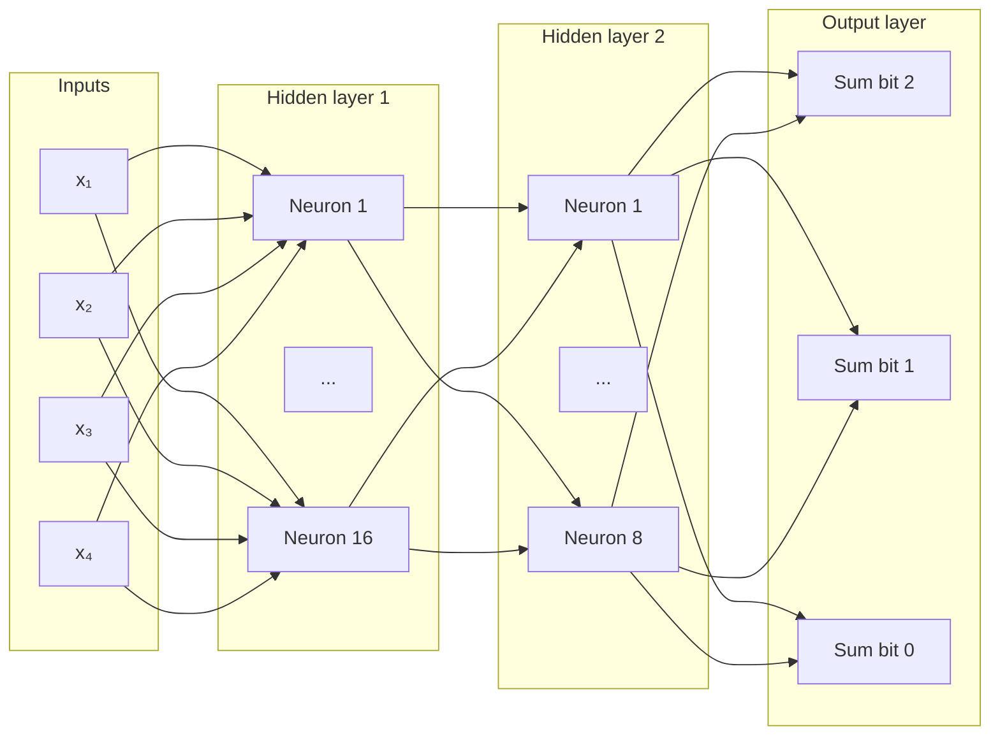

# Brainlet - A Neural Network

A neural network from scratch in Julia without third-party libraries.

## Current Implementation

This version trains on sums of two 2-bit numbers. It has 4 inputs, hidden layers of 16 and 8 neurons, and three output neurons. Every neuron connects to every neuron in the next layer. Hidden and output neurons use sigmoid. Cost is calculated using mean squared error. Backpropagation has replaced finited differences.



## Version Snapshots

- [Single neuron](https://github.com/aileks/Brainlet/tree/single-neuron) - learns `y = 2x`
- [AND, OR, and NAND gates](https://github.com/aileks/Brainlet/tree/or-and-gates) - one sigmoid neuron with two inputs
- [XOR gate](https://github.com/aileks/Brainlet/tree/xor-gate) - adds a hidden layer so the network can learn XOR
- [Binary adder](https://github.com/aileks/Brainlet/tree/binary-adder) - trains on sums of two 2-bit numbers using backpropagation

## Run

Requires Julia 1.10.12 or newer.

From the repository root, run:

```sh
julia --project=. main.jl
```

## Example Results

With seed `9999` after 100,000 epochs, predictions rounded to three decimal places:

| Input        | Prediction            | Expected  |
| ------------ | --------------------- | --------- |
| [0, 0, 0, 0] | [0.0, 0.007, 0.113]   | [0, 0, 0] |
| [1, 0, 0, 0] | [0.0, 0.055, 0.911]   | [0, 0, 1] |
| [0, 0, 0, 0] | [0.0, 0.961, 0.027]   | [0, 1, 0] |
| [1, 0, 0, 0] | [0.011, 0.963, 0.955] | [0, 1, 1] |
| [0, 0, 0, 0] | [0.0, 0.056, 0.901]   | [0, 0, 1] |
| [1, 0, 0, 0] | [0.001, 0.99, 0.081]  | [0, 1, 0] |
| [0, 0, 0, 0] | [0.011, 0.964, 0.958] | [0, 1, 1] |
| [1, 0, 0, 0] | [0.988, 0.03, 0.007]  | [1, 0, 0] |
| [0, 0, 0, 0] | [0.0, 0.96, 0.025]    | [0, 1, 0] |
| [1, 0, 0, 0] | [0.011, 0.963, 0.958] | [0, 1, 1] |
| [0, 0, 0, 0] | [0.972, 0.004, 0.2]   | [1, 0, 0] |
| [1, 0, 0, 0] | [0.996, 0.064, 0.834] | [1, 0, 1] |
| [0, 0, 0, 0] | [0.012, 0.962, 0.96]  | [0, 1, 1] |
| [1, 0, 0, 0] | [0.988, 0.025, 0.009] | [1, 0, 0] |
| [0, 0, 0, 0] | [0.996, 0.063, 0.83]  | [1, 0, 1] |
| [1, 0, 0, 0] | [0.999, 0.902, 0.16]  | [1, 1, 0] |
