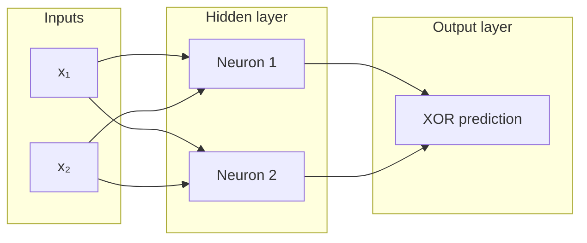

# Brainlet - A Neural Network

A neural network from scratch in Julia without third-party libraries.

## Current Implementation

This version is trained on an XOR gate. The XOR model has two inputs, two hidden neurons, and one output neuron. Every neuron in a layer receives every value from the previous layer. Each neuron has its own bias and uses the sigmoid activation function.



## Version snapshots

- [Single neuron](https://github.com/aileks/Brainlet/tree/single-neuron) - learns `y = 2x`
- [AND, OR, and NAND gates](https://github.com/aileks/Brainlet/tree/or-and-gates) - one sigmoid neuron with two inputs
- [XOR gate](https://github.com/aileks/Brainlet/tree/xor-gate) - adds a hidden layer so the network can learn XOR

## Run

Requires Julia 1.10.12 or newer. From the repository root:

```sh
julia --project=. main.jl
```

## Next steps

- Replace finite differences with backpropagation.
- Try a binary adder, then more complex training problems.
